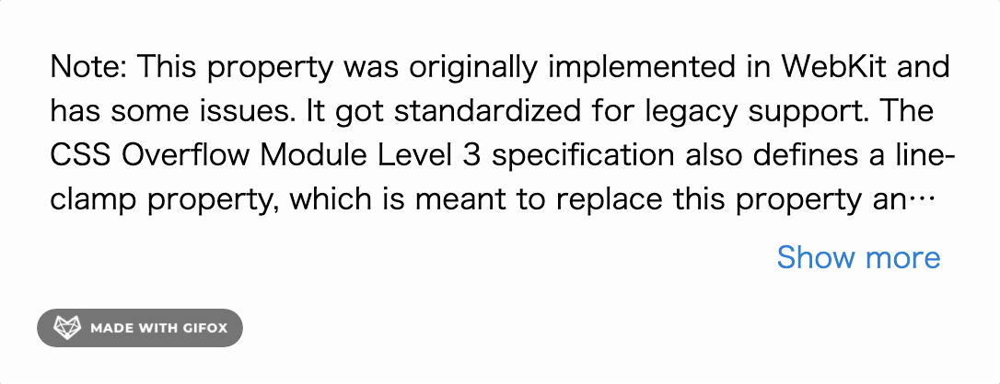

# show-more-text-demo ( for vue.js)

[](https://www.npmjs.com/package/show-more-text) [](https://www.npmjs.com/package/show-more-text) [](https://www.npmjs.com/package/show-more-text)

This is the demo for the show-more-text.
https://github.com/limlt/show-more-text-demo.git



### Run demo 
```
$ git clone https://github.com/limlt/show-more-text-demo
$ cd show-more-text-demo
$ npm install
$ npm run dev
$ open http://localhost:8080 in browser
```
